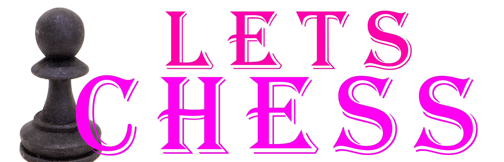
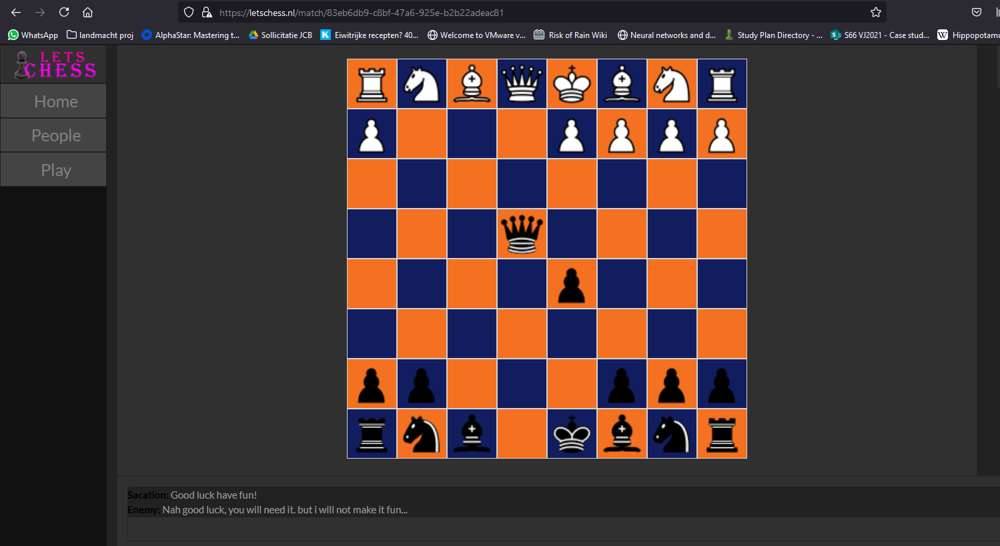
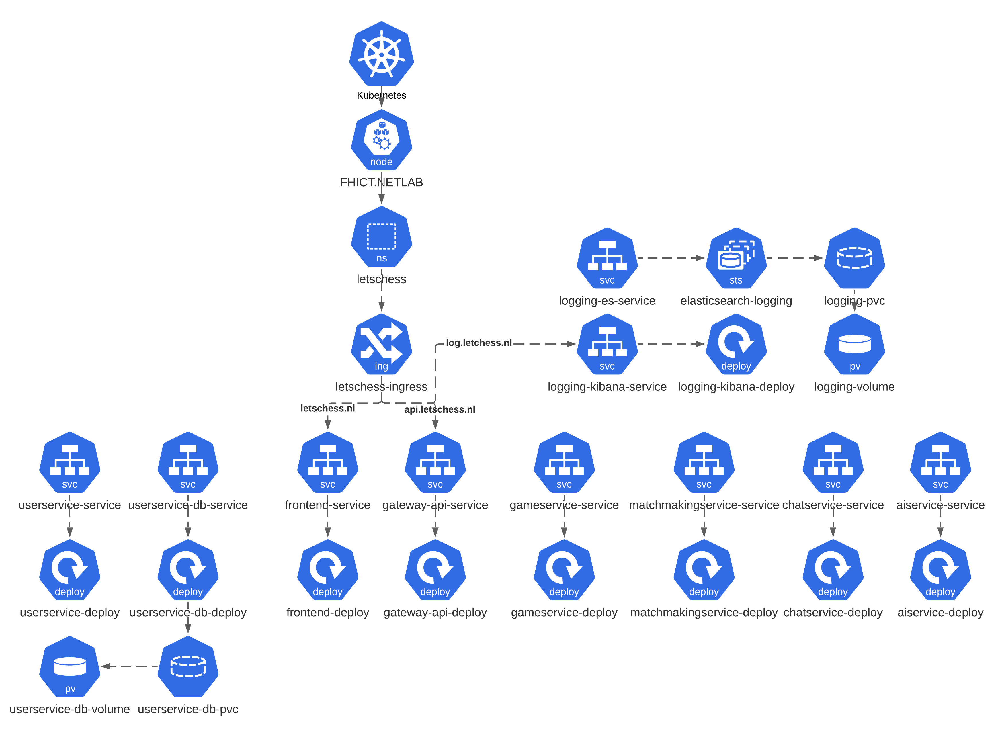
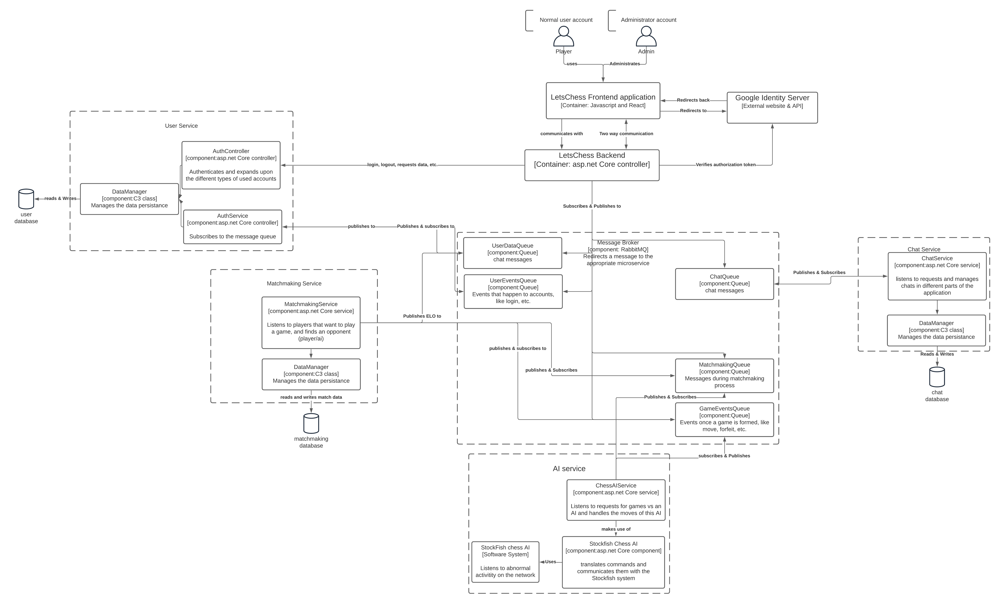

# LetsChess


Welcome to The letschess repository!

Letschess is a platform to play chess online vs other players or vs AI players.

# Build status:
|**Frontend:**|[](https://github.com/LuukEbenau/LetsChess-Front/actions/workflows/build-test.yml)|[](https://sonarcloud.io/dashboard?id=LuukEbenau_LetsChess-Front)[](https://sonarcloud.io/dashboard?id=LuukEbenau_LetsChess-Front)[](https://sonarcloud.io/dashboard?id=LuukEbenau_LetsChess-Front)[](https://sonarcloud.io/dashboard?id=LuukEbenau_LetsChess-Front)[](https://sonarcloud.io/dashboard?id=LuukEbenau_LetsChess-Front)|
|--:|---|---|
|**Backend:**|[](https://github.com/LuukEbenau/LetsChess-Backend/actions/workflows/build%20and%20test.yml)|[](https://sonarcloud.io/dashboard?id=LuukEbenau_LetsChess-Backend)[](https://sonarcloud.io/dashboard?id=LuukEbenau_LetsChess-Backend)[](https://sonarcloud.io/dashboard?id=LuukEbenau_LetsChess-Backend)[](https://sonarcloud.io/dashboard?id=LuukEbenau_LetsChess-Backend)[](https://sonarcloud.io/dashboard?id=LuukEbenau_LetsChess-Backend)[](https://sonarcloud.io/dashboard?id=LuukEbenau_LetsChess-Backend)|
|**UserService:**|[](https://github.com/LuukEbenau/LetsChess-UserService/actions/workflows/build%20and%20test.yml)|[](https://sonarcloud.io/dashboard?id=LuukEbenau_LetsChess-UserService) [](https://sonarcloud.io/dashboard?id=LuukEbenau_LetsChess-UserService)[](https://sonarcloud.io/dashboard?id=LuukEbenau_LetsChess-UserService)[](https://sonarcloud.io/dashboard?id=LuukEbenau_LetsChess-UserService)[](https://sonarcloud.io/dashboard?id=LuukEbenau_LetsChess-UserService)[](https://sonarcloud.io/dashboard?id=LuukEbenau_LetsChess-UserService)|
|**GameService:**|[](https://github.com/LuukEbenau/LetsChess-GameService/actions/workflows/build%20and%20test.yml)|[](https://sonarcloud.io/dashboard?id=LuukEbenau_LetsChess-GameService)[](https://sonarcloud.io/dashboard?id=LuukEbenau_LetsChess-GameService)[](https://sonarcloud.io/dashboard?id=LuukEbenau_LetsChess-GameService)[](https://sonarcloud.io/dashboard?id=LuukEbenau_LetsChess-GameService)[](https://sonarcloud.io/dashboard?id=LuukEbenau_LetsChess-GameService)[](https://sonarcloud.io/dashboard?id=LuukEbenau_LetsChess-GameService)|
|**MatchmakingService:**|[](https://github.com/LuukEbenau/LetsChess-MatchmakingService/actions/workflows/build%20and%20test.yml)|[](https://sonarcloud.io/dashboard?id=LuukEbenau_LetsChess-MatchmakingService)[](https://sonarcloud.io/dashboard?id=LuukEbenau_LetsChess-MatchmakingService)[](https://sonarcloud.io/dashboard?id=LuukEbenau_LetsChess-MatchmakingService)[](https://sonarcloud.io/dashboard?id=LuukEbenau_LetsChess-MatchmakingService)[](https://sonarcloud.io/dashboard?id=LuukEbenau_LetsChess-MatchmakingService)[](https://sonarcloud.io/dashboard?id=LuukEbenau_LetsChess-MatchmakingService)|

For more information about Contineous Integration, Delivery and deployments see: [CI&CD.md](./docs/CI&CD.md)

# Game in action


# Getting started
For starting the project you have 2 options:
- kubernetes
- local running & docker-compose

## kubernetes
- find a place with kubernetes installed to host the application
- ```sudo microk8s enable ingress dns metrics-server storage```
- ```sudo microk8s kubectl apply -f .```
### cookie for rabbitmq services communication
- ```echo -n "some secret key" > cookie```
- ```sudo microk8s kubectl create secret generic erlang-cookie --from-file=./cookie```
- ```rm cookie```
### for admin user
- ```echo -n "letschess" > user```
- ```echo -n "ht4boiuehgjofmcjhyudi" > pass```
- ```sudo microk8s kubectl create secret generic rabbitmq-admin --from-file=./user --from-file=./pass```
- ```rm pass```
- ```rm user```
## install operator
- ```sudo microk8s kubectl apply -f "https://github.com/rabbitmq/cluster-operator/releases/latest/download/cluster-operator.yml"```
- ```sudo microk8s kubectl config set-context --current --namespace=letschess```

### and now pull the repo
- ```git pull <this repository url"```
- ```cd LetsChess/kubernetes```
- optionally edit the hostnames of the ingress to something appropiate 

and then
- ```sudo microk8s kubectl apply -f ./frontend```
- etc. repeat for each folder

and thats it! your application should be up and running.

since the ingress makes use of host mapping, you should configure your OS's hostsfile to redirect the right (sub)domains to your application. 
in my case i've added:
```cs
# Letschess host mapping
192.168.220.29 letschess.nl
192.168.220.29 api.letschess.nl
192.168.220.29 matchmakingservice.letschess.nl
192.168.220.29 userservice.letschess.nl
192.168.220.29 gameservice.letschess.nl
192.168.220.29 aiservice.letschess.nl
192.168.220.29 chatservice.letschess.nl
192.168.220.29 log.letschess.nl
192.168.220.29 dashboard.letschess.nl
```
you probably need to restart your device for these changes to take into effect.

## The application also makes use of KNative, which you can enable as folowwing:
```ps
sudo microk8s enable ambassador
sudo microk8s kubectl apply -f ./knative
```

## local running
for local running you have to have visual studio installed and have a running docker environment.
Then, run the following commands:
```cmd
wsl -d docker-desktop
sysctl -w vm.max_map_count=262144
exit

docker compose up -d

cd LetsChess-Front/app
yarn
yarn start
```
when that's complete you only have to open the .sln file using visual studio and start all the services.

# The application architecture
the (kubernetes) application architecture is as following:


and to go into some more detail of the inner workings of the components of the application, i've designed a C3 diagram of the application:


# accessing Message queue
to access the message queue, you first need to know the username and password.
you can get these by:
```cmd
username="$(sudo microk8s kubectl get secret letschess-mq-default-user -o jsonpath='{.data.username}' | base64 --decode)"
password="$(sudo microk8s kubectl get secret letschess-mq-default-user -o jsonpath='{.data.password}' | base64 --decode)"
echo $username
echo $password
```
you can then access the mq admin panel at [http://mq.letschess.nl](http://mq.letschess.nl).
